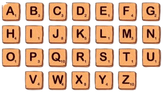
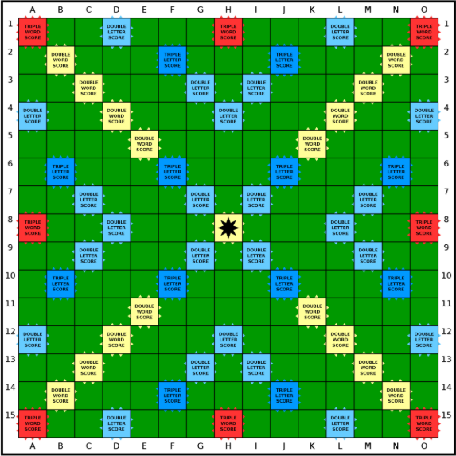
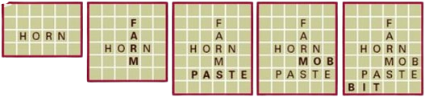

# Scrabble Book Game Project (Server Side)
## Introduction
This Project is crafted to exemplify diverse programming principles, encompassing server-client architecture, data structures, algorithms, and parallel programming. Through the creation of the Scrabble Book game from inception, our objective is to delve deeper into these principles and construct a fully operational gaming framework.

The Scrabble Book Game presents a twist on the traditional Scrabble format, where participants construct words on a designated board to accrue points. However, in this rendition, solely words sourced from specific literary works are deemed permissible. The gameplay entails drawing tiles, forming words, and strategically positioning them on the board to optimize point acquisition.
## Components
- **Tile Class**: Represents a letter tile with a score. Immutable objects ensure consistency.
- **Bag Class**: Manages a collection of tiles with quantities for each letter. Implements the Singleton pattern.
- **Word Class**: Represents a word placement on the game board, including tiles, position, and orientation.
- **Board Class**: Manages the game board state and tile placements. Implements methods for checking word legality and calculating scores.
 - **Server**: The server side of the Scrabble Book Game manages game operations using sockets. It listens for and accepts client connections, handles client requests, processes game moves, and sends updates back to clients. Sockets enable communication between the server and clients, facilitating data transfer for seamless gameplay.

    
    
## Gameplay Rules
1. Players draw tiles randomly from the bag to start the game.
2. Each player takes turns forming words on the game board.
3. Words must be legal and found in selected books.
4. Bonus squares on the board can double or triple the word or letter score.
5. The game ends after a set number of rounds.

    

##
- Developed by Guy Halfon
- Project supervised by Dr. Eliyahu Halaschi